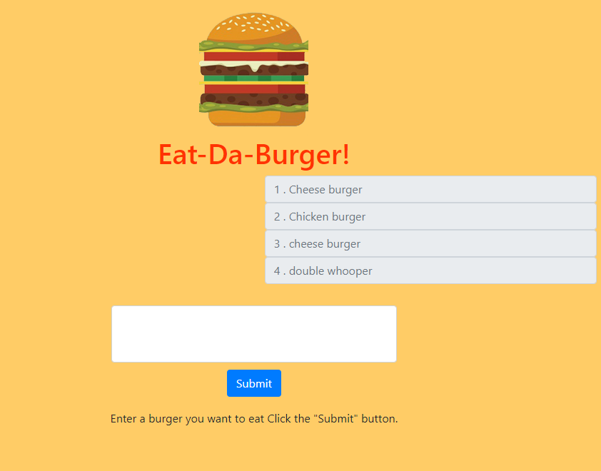
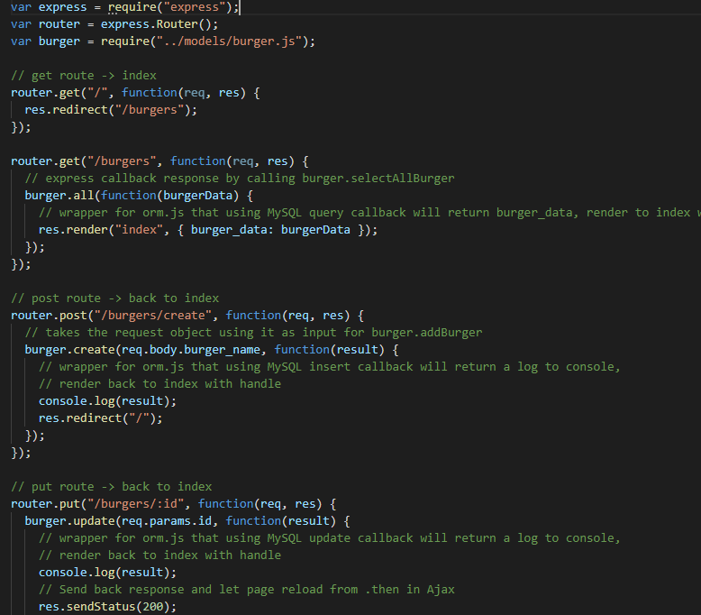
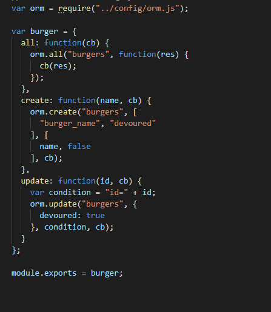

# Burger Application

## About The Page ## 

Using MySQL, Node, Express, Handlebars and a homemade ORM, the application create a burger logger. Node and MySQL are used to query and route data in the app, while Handlebars generate the HTML.

## Burger Application Screen Shot ##

Below are screenshots of my page and code for review:

### Screenshot of the Burger page ###

### Snippet of the Controller Code ###

### Snippet of the Models Code ###

## Built With ##

    MySql
    Express
    Node
    HTML 
    CSS 
    Bootstrap
    VS Code

### Installation ###

    Clone the repo

git clone https://github.com/Mitchelle-B/repo.git

## Contributing ##

    Fork the Project
    Create your Feature Branch (git checkout -b feature/AmazingFeature)
    Commit your Changes (git commit -m 'Add some AmazingFeature')
    Push to the Branch (git push origin feature/AmazingFeature)
    Open a Pull Request

## License ##

Distributed under the MIT License. See LICENSE for more information.
Contact

Project Link: https://github.com/Mitchelle-B/repo

## Acknowledgements ##

UWA Coding Bootcamp 